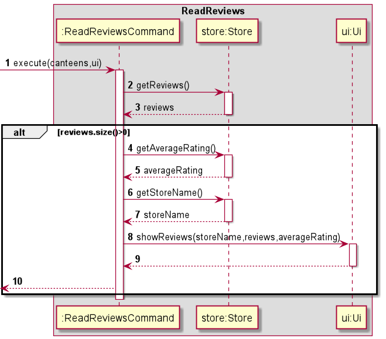
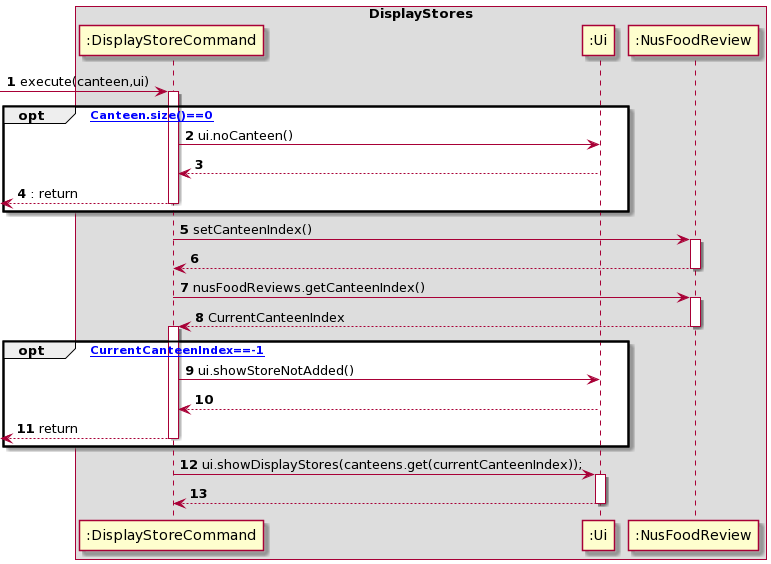
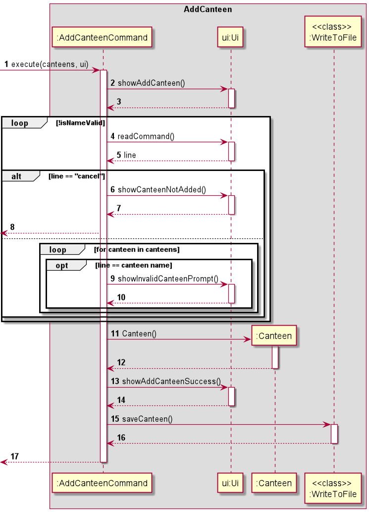
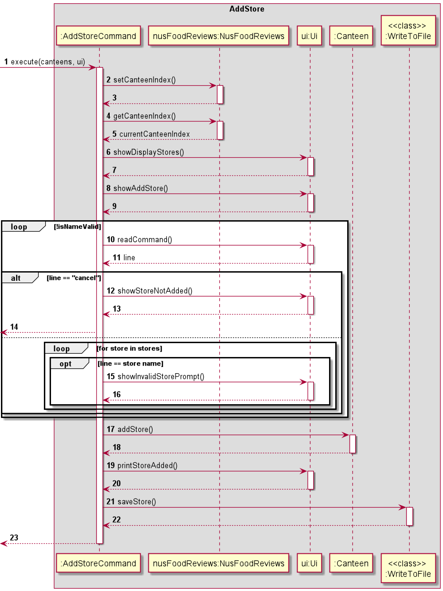
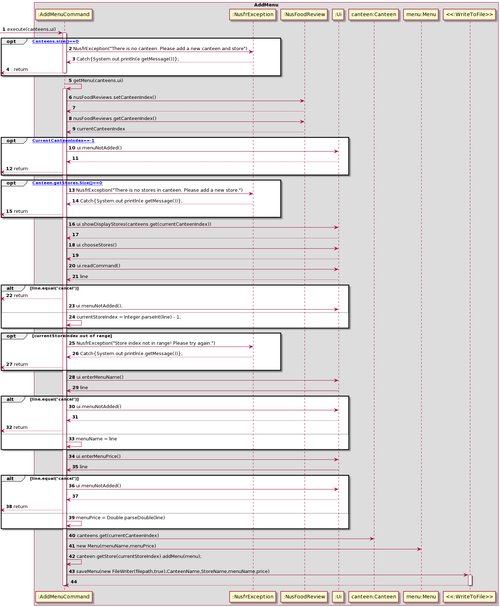
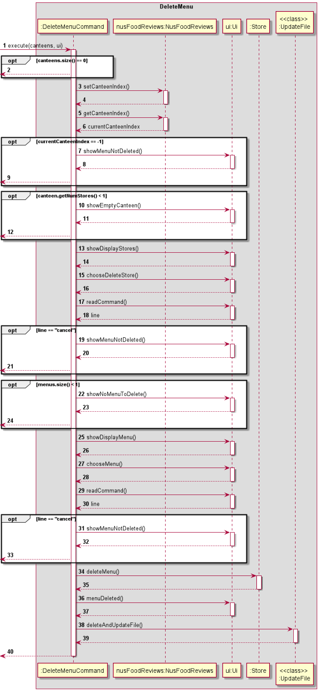
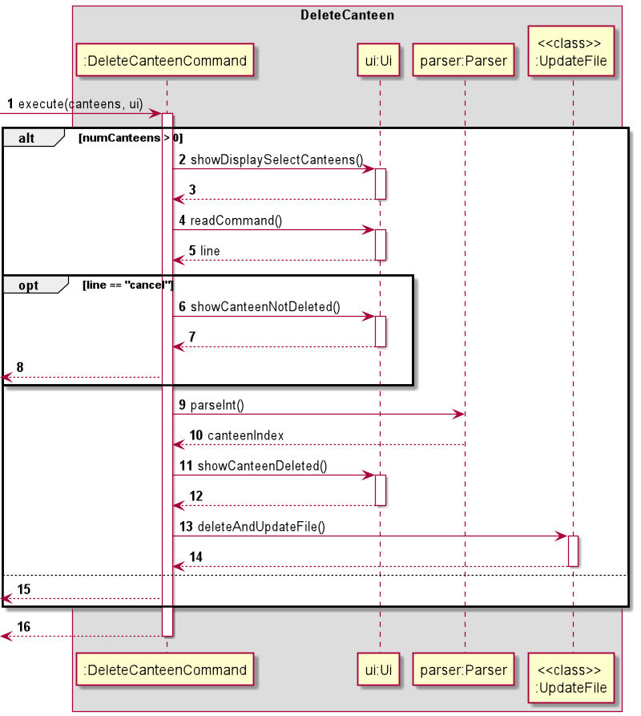
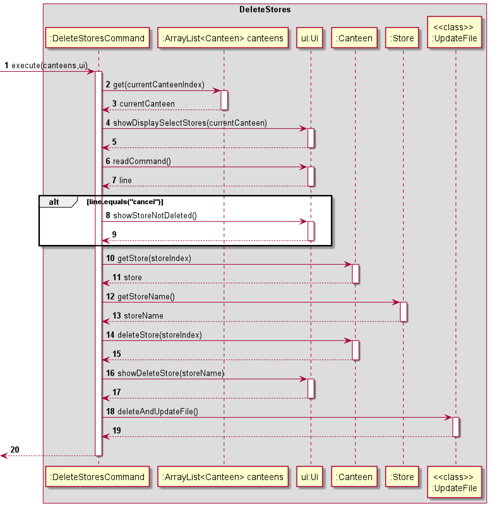
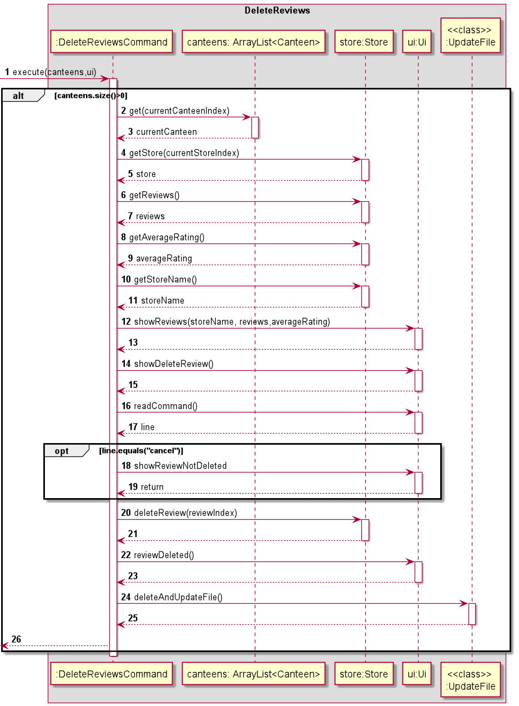

# Developer Guide 

## Table of Contents
* [Setup](#setup)
    * [Prerequisites](#prerequisites)
    * [Get Started](#getting-started)
* [Design](#design)
    * [Project Overview](#project-overview)
    * [Architecture](#architecture)
    * [Logic Component](#logic-component)
    * [Model Component](#model-component)
    * [Storage Component](#storage-component)
*  [Implementation](#implementation)
    * [Main](#main)
    * [Public User](#public-user)
    * [Admin User](#admin-user)
*  [Product Scope](#product-scope)    
    * [Target User Profile](#target-user-profile)
    * [Value Proposition](#value-proposition)
*  [User Stories](#user-stories)   
*  [Non-Functional Requirement](#non-functional-requirements)
*  [Glossary](#glossary)

## **Setup**
### Prerequisites
+ *JDK `11`* or beyond.
+ Permission rights to create a file and folder in your machine.
+ At least 10Mb of free space on disk.

### Getting-started
1. Fork this repo and clone it into your computer.
2. Run Intellij as your IDE (Highly Recommended).
3. Configure the JDK to JDK 11.
4. Make sure you have added the following plugins, if disable please re-enable it back by going to `File`>`Settings`>`Plugins`.
   
5. Import the project as a Gradle project by selecting build.gradle. 
6. Verify the setup: Run the nusfoodreviews and test a few commands. 
7. Run the gradle Checks and Tests to ensure they all pass.

## **Design**
### Project-Overview
NusFoodReviews is an application that is built using Java. It has cross-platform ability and is able to run on MAC-OS, 
Windows and Linux. When run, NusFoodReviews allows user to view selected canteens, stores with their menus, reviews and ratings. In addition,
user is able to leave reviews and ratings to the stores. On the other hand the user can choose to run as admin, and the
password is `Password`. When run as admin the user is able to `add` or `remove` canteens, stores, menu and reviews. These admin
functions allows the app to be moderated and maintained by the person in charge. 

### Architecture

The Architecture Diagram shown above explains the high-level design of NusFoodReviews Application. The following is a brief overview of each component.

`Main` is responsible for,
+ At app launch: Initializes the components in the correct sequence, and connects them up with each other.
+ At shut down: Shuts down the components and invokes cleanup methods where necessary.

`Resources` contains the bundled resource(database file) of the application. When user run the application for the first time, 
it will read from this resource and copy it to the local machine. Return user will not need to read from this resource anymore. 

`Commons` represents a collection of classes used by multiple other components.
  

  
The rest of the App consists of four components.
* [**`UI`**]: The UI of the App. 
* [**`Logic`**](#logic-component): The command executor.
* [**`Model`**](#model-component): Holds the data of the In-App memory.
* [**`Storage`**](#storage-component): Reads data from text file, and write to text file. 

### Logic-Component

### Model-Component

### Storage-Component

The `Storage` component,
* For new user, will first create a new directory and text file.
* Next, will load the data from resource and write it into the newly created text file.
* At the same time, it will also load into the in-app data.
* If it is an existing user, it will only loads data from the text file into in-App data.  

## **Implementation** 
This section describes some noteworthy details on how certain features are implemented.

There are 2 types of user :
+ [**`Public User`**](#public-user)
+ [**`Admin User`**](#admin-user)

### Main

When the application is launched, an Ui object and Parser object is instantiated.
To instantiate the Parser object, the main NusFoodReviews and Ui object is passed.

### Public User
For public users, the list of commands is shown below:

* Display selected store sample menu: [**`menu`**](#display-menu) 
* Display all reviews of the selected store : [**`reviews`**](#display-reviews)
* Add a new review of the selected store: [**`add`**](#add-reviews)
* Goes back to home page to select canteen: [**`home`**](#home)
* Display all the stores of the selected canteen: [**`list`**](#list)
* Goes back to login page: `login` (not worthy)
* Exiting the application: `exit`(not worthy)

### Display Menu

To display menus, `DisplayMenusCommand.execute()` is called, passing in
an ArrayList of canteens and the Ui object instantiated in NusFoodReviews.

When DisplayMenusCommand was first instantiated, the relevant Store object was passed
into the constructor. `DisplayMenusCommand.execute()` will then call `getMenus()` on the
store object to get an ArrayList of menus, before passing the ArrayList to the ui object
to be displayed by calling `Ui#showDisplayMenu()`.

### Display Reviews

To read reviews, `ReadReviewsCommand.execute()` is called passing in an ArrayList of
canteens and the Ui object instantiated in nusFoodReviews.

When ReadReviewsCommand was first instantiated, the relevant Store object was passed
into the constructor. `ReadReviewsCommand.execute()` will then call `getReviews()` on the
store object to get an ArrayList of reviews, then calling `getAverageRating()` to get the
average rating of the store. After that, `getStoreName()` is also called to get the store
name of the store. These parameters are then passed to the ui object to be displayed by calling
`ui.showReviews()`

### Add Reviews

To add reviews, `AddReviewCommand.execute()` is called passing in an ArrayList of
canteens and the Ui object instantiated in nusFoodReviews.

`AddReviewCommand.execute()` will then call `getReviewFromUser(ui)` to get the description and rating. Next, it will 
then create a new review object and add it into Store by calling `store.addReview(Review)`. Lastly, it will call
`saveReview((filepath,true),canteen,store,description,rating,dateTime)` by instantiating the class `WriteToFile` to 
save the new review into the text file database.

### Home 

To reset the store and canteen index in nusFoodReviews, `HomeCommand#execute()` is called,
passing in an ArrayList of canteens, and the ui object instantiated in NusFoodReviews.

When `HomeCommand` is first called, we pass the main NusFoodReviews object to the
constructor. This allows the `Command` to interact with the main object when `execute` is called.

### List

To see the list of stores in a canteen, `DisplayStoreCommand.execute()` is called passing in an ArrayList of
canteens and the Ui object instantiated in nusFoodReviews.

First thing, if canteen size is 0 the command will be ended telling the user that there is no canteen no view.
Next, if there are canteens available then user will choose one of the canteen by calling `NusFoodReviews.setCanteenIndex`.
After choosing it will call `nusFoodReviews.getCanteenIndex()` to get the canteen's index to view its stores. If canteen's
index is -1, it means that user input is cancel and it will return from that function. Lastly, `ui.showDisplayStores(canteens.get(currentCanteenIndex))` 
will be called to display the list of stores in the chosen canteen.

### Help Command

Help command is  used to showcase the user all the available commands and respective descriptions about what the
commands are all about. HelpCommand#execute is called, passing in an ArrayList of
canteens, and the ui object instantiated in NusFoodReviews.

To reset the store and canteen index in nusFoodReviews, HomeCommand#execute() is called, passing in an ArrayList of
canteens, and the ui object instantiated in NusFoodReviews.

### Admin User

For an admin user, the list of commands is shown below:

* View canteens [**`1`**](#view-canteens)
* Add canteen [**`2`**](#add-canteen)
* Add a store in a canteen [**`3`**](#add-store)
* Add Menu to a store [**`4`**](#add-menu)
* Delete canteen [**`5`**](#delete-canteen)
* Delete a store in a canteen [**`6`**](#delete-stores)
* Delete reviews in a store [**`7`**](#delete-reviews)
* Delete menu in a store [**`8`**](#delete-menu)
* View stores in a canteen [**`9`**](#list) (same as public user)
* Exit `0`(Not worthy)

### Run as admin

Once admin is verified in NusFoodReviews, The program will start asking for inputs and `Parser#parseAdminCommand()` will be
taking in these input and create commands object for admin user to execute. 

### View Canteens

To see the list of canteens, `DisplayCanteensCommand.execute()` is called passing in an ArrayList of
canteens and the Ui object instantiated in nusFoodReviews.

It will then call `ui.ShowDisplayCanteens(canteens)` by passing over the arraylist of canteens.

### Add Canteen

To add a canteen, `AddCanteenCommand#execute()` is called, 
passing in an ArrayList of canteens and the Ui object instantiated in NusFoodReviews.

`Ui#showAddCanteen()` is called to display the add canteen prompt. 
The program will then wait for user input, looping continuously if a valid Canteen name is not entered. 
Invalid names include: existing canteen names. If the user inputs 'cancel', 
the loop is exited and the program returns from AddCanteenCommand.

Once a valid CanteenName is entered,
a new Canteen object is instantiated and added to the ArrayList of canteens.
`Ui#showAddCanteenSuccess()` is then called to display canteen added confirmation.

Additionally, the static method `WriteToFile#saveCanteen()` is called to update the canteen in storage.

### Add Store

To add a store, `AddStoreCommand#execute()` is called, passing in
an ArrayList of canteens and the Ui object instantiated in NusFoodReviews.

A new Store object is then instantiated, and added to the Canteen's ArrayList of stores.
`Ui#printStoreAdded()` is called to display store added confirmation.

### Add Menu

This is the longest diagram amongst all the others because `menu` is the deepest element. Canteen -> Store -> Menu.
To add a canteen, `AddCanteenCommand#execute()` is called, passing in an ArrayList of canteens and the Ui object instantiated in NusFoodReviews.
First, it will check if there are canteens available. Next, it will check if there are stores in the canteen. Then if both are
checked and valid it will ask user to choose a canteen and store. Then it will ask user to input menu description and price.
It will again check if the price entered is number. If all is passed it will then add this menu to the store. Lastly it will
then append to the data text file. In between it will check if user enters `cancel`. If yes, it will terminate the command.

### Delete Menu

### Delete Canteen

To delete a canteen, `DeleteCanteenCommand#execute()` is called, passing in
an ArrayList of canteens and the Ui object instantiated in NusFoodReviews.

The program first checks if the ArrayList of canteens has more than 0 canteens.
If there are, the program will continue with the canteen deletion process.
If there are no canteens yet, a short message is printed and the program returns from `DeleteCanteenCommand`.

The remaining canteen deletion process is as follows:
`Ui#showDisplaySelectCanteens()` is first called to display canteens for the user to select.
The program waits for user input with`Ui#readCommand()`. If the input is 'cancel',
`Ui#showCanteenNotDeleted()` is called and the program returns from `DeleteCanteenCommand`.
Otherwise, `Parser#parseInt()` is called to check if the user input is a valid index of the canteens array.
The canteen is then removed from the canteens ArrayList,
and `Ui#showCanteenDeleted()` is called to display the canteen deleted message.
The static method `UpdateFile#deleteAndUpdateFile()` is also called to update the storage.

### Delete Stores

To delete a store, DeleteStoreCommand#execute() is called, passing in an
ArrayList of canteens and the Ui object instantiated in NusFoodReviews.

The program first checks if the ArrayList of canteens has more than 0 canteens.
If there are, the program will continue with the store deletion process.
If there are no canteens yet, a short message is printed and the program returns from `DeleteStoreCommand`.

When `DeleteStoreCommand` is instantiated, the reference to the main program nusFoodReviews and the parser is passed.
`NusFoodReviews#setCanteenIndex()` will first be called to prompt the user on which canteen they wish to look at.
The result for this is saved as a private int in `NusFoodReviews`,
and can be accessed by calling `NusFoodReviews#getCanteenIndex()`.

The remaining store deletion process is as follows:
`canteens.get(currentCanteenIndex)` is first called to get the Canteen that the user chose and currentCanteen is returned.
Then, `Ui#showDisplaySelectStores(currentCanteen)` is called to display
a list of stores for the user to select.
The program waits for user input with`Ui#readCommand()`. If the input is 'cancel',
`Ui#showStoreNotDeleted()` is called and the program returns from `DeleteStoreCommand`.
Otherwise, `Parser#parseInt()` is called to check if the user input is a valid index of the store.
Then, `currentCanteen.getStore(currentCanteenIndex)` is called to get the store the user chose and `store.getStoreName()`
is called to get the store name. The store is then removed with `currentCanteen.deleteStore(storeIndex)`, 
and `Ui#showDeleteStore(storeName)` is called to display the message that the store was deleted.
The static method `UpdateFile#deleteAndUpdateFile()` is also called to update the storage.

### Delete Reviews

To delete a store, DeleteReviewCommand#execute() is called, passing in an
ArrayList of canteens and the Ui object instantiated in NusFoodReviews.

The program first checks if the ArrayList of canteens has more than 0 canteens.
If there are, the program will continue with the store deletion process.
If there are no canteens yet, a short message is printed and the program returns from `DeleteReviewCommand`.

When `DeleteReviewCommand` is instantiated, the reference to the main program nusFoodReviews and the parser is passed.
`NusFoodReviews#setCanteenIndex()` will first be called to prompt the user on which canteen they wish to look at.
The result for this is saved as a private int in `NusFoodReviews`,
and can be accessed by calling `NusFoodReviews#getCanteenIndex()`.

`NusFoodReviews#setStoreIndex()` will then  be called to prompt the user on which store they wish to look at.
The result for this is saved as a private int in `NusFoodReviews`,
and can be accessed by calling `NusFoodReviews#getStoreIndex()`.

The remaining review deletion process is as follows:
`canteens.get(currentCanteenIndex)` is first called to get the Canteen that the user chose and currentCanteen is returned.
Then, `currentCanteen.getStore(currentCanteenIndex)` is called to get the store the user chose and Store#getReviews() returns
the ArrayList of reviews. To get the averageRating, Store#getAverageRating() is called. If reviews size is <=0, an error message would
be printed and the program returns from `DeleteReviewCommand'.` `store.getStoreName()` is called to get the store name and
`Ui#showReviews(storeName,reviews,averageRating)` is called to display
a list of reviews to delete. Then `Ui#showDeleteReview()` is called to ask user to input index of review to delete.
The program waits for user input with`Ui#readCommand()`. If the input is 'cancel',
`Ui#showStoreNotDeleted()` is called and the program returns from `DeleteStoreCommand`.
Otherwise, `Parser#parseInt()` is called to check if the user input is a valid index of the store.
The store is then removed with `Store#deleteReview(reviewIndex)`,
and `Ui#reviewDeleted()` is called to display the message that the review was deleted.
The static method `UpdateFile#deleteAndUpdateFile()` is also called to update the storage.

## Product scope
### Target user profile

The target user would be NUS students/staffs who wish 
to get updated reviews about the food places in NUS.

### Value proposition

By consolidating food reviews from NUS canteens from students/staffs, 
it aims to allow new students/staffs to have a better experience at these food stores.

## User Stories

|Version| As a ... | I want to ... | So that I can ...|
|--------|----------|---------------|------------------|
|v1.0|user|see list of stores|to find good food|
|v1.0|user|read reviews|decide on where to eat|
|v1.0|user|view menu and price of items|know the type of food sold|
|v1.0|user|add reviews and rating|provide feedback on store|
|v1.0|admin|login|verify myself|
|v2.0|admin|add a new canteen|manage the app
|v2.0|admin|add a new menu|manage the app
|v2.0|admin|delete an existing menu|manage the app
|v2.0|admin|delete an existing canteen|manage the app
|v2.0|admin|add timestamp to reviews|know the date and time of the review
|v2.0|admin|add help command|to let user know the availability of commands.
|v2.0|admin|delete a store|update availability of stores
|v2.0|admin|delete a review|restrict inappropriate reviews
|v2.0|developer|Bundle Resource|Allow users to have a set of database upon download of application

## Non-Functional Requirements

1. This application should work on any OS as long as it has Java 11 installed.

2. Should be able to hold up to 1000 stores with their menus and and reviews without much lagging.

3. A user with average typing speed for regular English text should be able to navigate around this application easily.

4. Admin functions is included to optimize the maintainability of the application. They should be able to amend the canteens,stores,menus and reviews easily with the guided UI.
## Glossary

* Mainstream OS : Windows, Linux, Unix, OS-X

* Canteen : A food place with many stores

* Menu : Name of the food

* Ratings : Evaluation or assessment of the food from a store

## Instructions for manual testing

:information_source: **Note:** These instructions only provide a starting point for testers to work on;
testers are expected to do more *exploratory* testing.

### Launch and shutdown

1. Initial launch

    1. Download the jar file and copy into an empty folder

    1. Type java -jar nusfoodreviews.jar

### To toggle between two modes

1. Login
   Prerequisites: User must be in a selected store
    1. Test case: `login` 
    Expected: Brings user back to login page to select as admin or public user
    1. Test case: `login 2` 
    Expected: The user is not brought to login page and an error message tells user
       to select either 1 or 2 to determine the type of user
    1. Test case: `login <>` 
       Expected: Input cannot contain Delimeters
### Public User mode
Prerequisites: User must have selected `1` as public user

1. Choose canteens  
   Prerequisites: Selects a canteen when public user is chosen
    1. Test case: `1` 
       Expected: Brings user to different stores in the canteen selected
    1. Test case: `-1` 
       Expected: The user is not brought to the next page as stated above
       but an error message is printed to ask user to enter valid index
    1. Other incorrect commands to try: `0`, `10`,  
       Expected: Similar to previous
   1. Other incorrect commands to try: `%`, `^`,  
      Expected: The user is not brought to the next page as stated above
      but an error message is printed to ask user to enter valid integer index from the list
    1. Test case: `<.` 
           Expected: Input cannot contain Delimeters
       
2. View list of stores
   Prerequisites: List all stores using the `list` command. Multiple stores in the list.
    1. Test case: `1` 
       Expected: Brings user to the selected store and user can choose the command to execute.
    1. Test case: `-1` 
       Expected: The user is not brought to the next page as stated above
       but an error message is printed to ask user to enter valid index from the list
    1. Other incorrect commands to try: `0`,`17`  
       Expected: Similar to previous
    1. Other incorrect commands to try: `^`, `,` 
      Expected: The user is not brought to the next page as stated above
      but an error message is printed to ask user to enter valid integer index from the list
    1. Test case: `<.` 
       Expected: Input cannot contain Delimeters
3. View menu
   Prerequisites: Selects a store from the list of stores.
    1. Test case: `menu` 
       Expected: Brings user to view the menu of the store.
    1. Test case: `menu 2` 
       Expected: The user is not brought to the next page as stated above
       but an error message is printed to ask user to enter a valid command
    1. Other incorrect commands to try: `menu 17`, `menu ^`,`!`  
       Expected: Similar to previous
    1. Test case: `menu <>` 
       Expected: Input cannot contain Delimeters
4. View reviews
   Prerequisites: Selects a store from the list of stores.
    1. Test case: `reviews` 
       Expected: Brings user to view the reviews of the store.
    1. Test case: `review` 
       Expected: The user is not brought to the next page as stated above
       but an error message is printed to ask user to enter a valid command
    1. Other incorrect commands to try: `reviews 17`, `reviews ^`,`!`  
       Expected: Similar to previous
    1. Test case: `reviews <>` 
       Expected: Input cannot contain Delimeters
       
5. Add reviews
   Prerequisites: Selects a store from the list of stores.
    1. Test case: `add` 
       Expected: Brings user to input their review
       When prompted about rating:
       1. Test case:`5`
       Expected: Review is added successfully
   1. Test case: `add` 
      Expected: Brings user to input their review
      When prompted about rating:
      1. Test case:`0`
      Expected: Review is not added successfully and an error message
         is shown to ask user to enter valid rating
    1. Test case: `add 4` 
       Expected: The user is not brought to the next page as stated above
       but an error message is printed to ask user to enter a valid command
    1. Other incorrect commands to try: `add 17`, `add ^`,`!`  
       Expected: Similar to previous
    1. Test case: `add <>` 
       Expected: Input cannot contain Delimeters
       
6. Exit
   Prerequisites: User must be in a selected store
   1. Test case: `exit` 
   Expected: Exits the application
   1. Test case:`exit 5`
   Expected: The user cannot exit the application as stated above
      but an error message is printed to ask user to enter a valid command
   1. Other incorrect commands to try: `exit 17`, `exit ^`,`!`  
       Expected: Similar to previous
   1. Test case: `exit <>` 
       Expected: Input cannot contain Delimeters

### Admin mode
1. Enter Password for verification
   Prerequisites: User must have selected `2` for admin mode
    1. Test case: `Password` 
       Expected: The application prints that admin has been successfully verified and
       brings admin to a list of tasks
    1. Test case:`password`
       Expected: The user cannot enter the application as stated above
       but an error message is printed to ask user to re-enter password
    1. Other incorrect commands to try: `password 17`, `password ^`,`!`  
       Expected: Similar to previous
    1. Test case: `password <>` 
       Expected: Input cannot contain Delimeters
2. View Canteens
   Prerequisites: User must have entered the correct password
    1. Test case: `1` 
       Expected: Displays the list of canteens
    1. Test case:`10`
       Expected: The user cannot view the lists of canteens and an error
       message is printed to ask users to enter valid index
    1. Other incorrect commands to try: `hello`, `exit ^`,`!`  
       Expected: Similar to previous
    1. Test case: `hello <>` 
       Expected: Input cannot contain Delimeters
       
3. Add Canteen
   Prerequisites: User must have entered the correct password
    1. Test case: `2` 
       Expected: Prompts the user to enter canteen to be added
    1. Test case:`10`
       Expected: The user cannot add canteen and an error
       message is printed to ask users to enter valid index
    1. Other incorrect commands to try: `hello`, `exit ^`,`!`  
       Expected: Similar to previous
    1. Test case: `hello <>` 
       Expected: Input cannot contain Delimeters
       
4. Add Store
    1. Test case: `3` 
       Expected: Prompts the user to add a store in one of the canteens
       If selected canteen is within index, name of store would be prompted
       Else, an error message would be printed to ask user to enter a valid index in the range of canteens.
    1. Test case:`10`
       Expected: The user cannot add store and an error
       message is printed to ask users to enter valid index
    1. Other incorrect commands to try: `hello`, `exit ^`,`!`  
       Expected: Similar to previous
    1. Test case: `hello <>` 
       Expected: Input cannot contain Delimeters
       
5. Add Menu
    1. Test case: `4` 
       Expected: Prompts the user to add a menu in one of the stores in one of the canteens
       If selected canteen is within index, store name would be prompted
       Else, an error message is printed to ask user to enter a valid index in the range of canteens.
       If selected store is within index, menu could be added.
       Else, an error message is printed to ask user to enter a valid index in the range of stores.
    1. Test case:`10`
       Expected: The user cannot add menu and an error
       message is printed to ask users to enter valid index
    1. Other incorrect commands to try: `hello`, `exit ^`,`!`  
       Expected: Similar to previous
    1. Test case: `hello <>` 
       Expected: Input cannot contain Delimeters
       
6. Delete Canteen
    1. Test case: `5` 
       Expected: Prompts the user to delete a canteen in one of the canteens 
       If selected canteen is within index, canteen would be deleted
       Else, an error message is printed to ask user to enter a valid index in the range of canteens.
    1. Test case:`10`
       Expected: The user cannot delete canteen and an error
       message is printed to ask users to enter valid index
    1. Other incorrect commands to try: `hello`, `exit ^`,`!`  
       Expected: Similar to previous
    1. Test case: `hello <>` 
       Expected: Input cannot contain Delimeters
       
7. Delete Store
    1. Test case: `6` 
       Expected: Prompts the user to delete a store in one of the canteens 
       If selected canteen is within index, user would have to choose a store
       Else, an error message is printed to ask user to enter a valid index in the range of canteens.
       If selected store is within index, store would be deleted.
       Else, an error message is printed to ask user to enter a valid store index
    1. Test case:`10`
       Expected: The user cannot delete stores and an error
       message is printed to ask users to enter valid index
    1. Other incorrect commands to try: `hello`, `exit ^`,`!`  
       Expected: Similar to previous
    1. Test case: `hello <>` 
       Expected: Input cannot contain Delimeters
       
8. Delete Review
    1. Test case: `7` 
       Expected: Prompts the user to delete a review in one of the canteens 
       If selected canteen is within index, user would have to choose a store.
       Else, an error message is printed to ask user to enter a valid index in the range of canteens.
       If selected store is within index, the review number selected would be deleted
       Else, an error message is printed to ask user to enter a valid review index
    1. Test case:`10`
       Expected: The user cannot delete reviews and an error
       message is printed to ask users to enter valid index
    1. Other incorrect commands to try: `hello`, `exit ^`,`!`  
       Expected: Similar to previous
    1. Test case: `hello <>` 
       Expected: Input cannot contain Delimeters
       
9. Delete Menu
    1. Test case: `8` 
       Expected: Prompts the user to delete a menu in one of the canteens 
       If selected canteen is within index, user would have to choose a store.
       Else, an error message is printed to ask user to enter a valid index in the range of canteens.
       If selected store is within index, the menu index selected would be deleted
       Else, an error message is printed to ask user to enter a valid review index
    1. Test case:`10`
       Expected: The user cannot delete menu and an error
       message is printed to ask users to enter valid index
    1. Other incorrect commands to try: `hello`, `exit ^`,`!`  
       Expected: Similar to previous
    1. Test case: `hello <>` 
       Expected: Input cannot contain Delimeters
       
10. View Stores
    1. Test case: `9` 
       Expected: Prompts the user to view stores in one of the canteens
       If selected canteen is within index, user would have to choose a store.
       Else, an error message is printed to ask user to enter a valid index in the range of canteens.
       If selected store is within index, the stores are shown.
    1. Test case:`10`
       Expected: The user cannot view stores and an error
       message is printed to ask users to enter valid index
    1. Other incorrect commands to try: `hello`, `exit ^`,`!`  
       Expected: Similar to previous
    1. Test case: `hello <>` 
       Expected: Input cannot contain Delimeters
       
11. Exit Application
1. Test case: `0` 
   Expected: The user exits out of application
1. Test case:`10`
   Expected: The user cannot exit application and an error
   message is printed to ask users to enter valid index
1. Other incorrect commands to try: `hello`, `exit ^`,`!`  
   Expected: Similar to previous
1. Test case: `hello <>` 
   Expected: Input cannot contain Delimeters